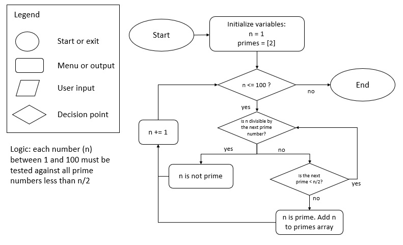

#### 1. Research the development of the internet from 1980 to today. You must describe at least FIVE key events in the development of the internet. You can refer to events, people of significance, or technologies and how they have changed over time.

Word count guide 300 - 500 words.
- 1983: TCP/IP (transmission control protocol/internet protocol) is standardised. TCP/IP is the set of rules that specifies how data is exchanged over the internet. The TCP portion controls how the data is broken into packets by the sender and then reassembled correctly by the receiver. The IP portion defines the address that the packets will be sent to and the route that each packet will take 

- 1989: Tim Berners-Lee begins work on a project to allow millions of computers to connect using an emerging technology called hypertext. In this project, he creates three fundamental technologies that are used in the web even today: 
    - HTML, hypertext markup language used to organise information on webpages.
    - URI, uniform resource identifiers used to uniquely identify each resource on the web.
    - HTTP, hypertext transfer protocol which is used for the retrieval of linked resources across the web.

- 1989: the first commercial ISP - The World, operated by a small software company called Software Tool & Die - begins serving customers. Prior to this, the internet was reserved for research and military use. This was met with controversy as Government institutions and universities blocked or attempted to shut down The World as they believed that the internet should remain exclusively for research and military use, not commercial. This controversy was resolved when the National Science Foundation, a US government agency which supports research in all non-medical fields of science and engineering, granted Software Tool & Die permission to provide public internet access.

- 1990: the first internet search engine, Archie, was developed by Alan Emtage at McGill University. Being the first-ever internet search engine, Archie was not as sophisticated as modern search engines like Google. Archie functioned by taking a string input or regular expression from the user and retrieving a file matching the query. Importantly, Archie did not index the content of files and therefore only the names of files were searchable.

- 1991: the first website is built by Tim Berners-Lee at http://info.cern.ch/. The website ran on a NeXT computer at CERN. It provided an explanation about what the world wide web was, how one could own a browser, technical information about the internet, people involved in the project, and even allowed people to access the code for the internet. The website was built using raw HTML and includes all the default styling that HTML has even today, such as Times New Roman font, left-aligned elements, and blue underlined text for links.

#### 2. Define the features of the following technologies that are essential in terms of the development of the internet:
- packets
- IP addresses (IPv4 and IPv6)
- routers and routing
- domains and DNS

Explain how each technology has contributed to the development of the internet.

Word count guide: 50 - 100 words per dot point

###### Packets
Packets are formatted units of data carried by a packet-switched network. A packet consists of control information and user data. Control information is the data for delivering the packet e.g. the sender’s IP address, receiver’s IP address, or number of packets the data has been broken into. A packet is usually 1000-1500 bytes of data. Packets have contributed to the development of the internet because splitting transmitted data into packets and having each packet choose the best available route, instead of all having a pre-defined route, makes the network more efficient. As the route that each packet will take is determined individually on a millisecond-by-millisecond basis, the network can balance the load across different piece of equipment and if there is a problem with one piece of network equipment, the packets can be routed around the problem, ensuring delivery of all the user data.

###### IP addresses (IPv4 and IPv6)
An IP (internet protocol) address is a unique number assigned to each device connected to a computer network that uses IP for communication. IPv4 defines as IP addresses as a 32-bit number, however as the internet grew and more unique addresses were required, IPv6 using 128 bits for addresses was developed. The number of available IPv6 addresses is 2<sup>128</sup> or approximately 3.4 x 10<sup>38</sup>. IP addresses have contributed to the development of the internet by allowing each node on the network to have unique addresses for communication.

###### Routers and routing
Routing is the process of selecting a path for traffic in a network and routers are the devices within the network that performs this function. On the internet, routers direct packets to travel down specific cables to other routers which perform the same function, eventually directing the packets to their intended destination. Routers have algorithms which consider throughput, overhead, stability and other factors to select the best route and stores these routes in a table. Routing has contributed to the development of the internet by allowing information in the form of packets to be delivered as fast as possible.

###### Domains and DNS
A domain name server maintains a directory of domain names and translates them into IP addresses. Each website has an IP address, for example the IP address of google is 172.217.25.142, which can be typed into the URL bar to access the site. However this is difficult for a human being to remember. Domain names allow the user to enter a name like ‘google.com’ into the URL bar, and as the DNS keeps a record of the IP addresses associated with that name, this connects to the website. DNS contributed to the development of the internet by making web browsing simpler for human beings, who only need to remember the name of a website instead of the IP address.

#### 3. Define the features of the following technologies that are essential in terms of the development of the internet:
- TCP (word count guide: 150 - 300 words)
- HTTP and HTTPS (word count guide: 150 - 300 words)
- web browsers (requests, rendering and developer tools) (200 - 300 words)

Explain how each technology has contributed to the development of client and server communication over the internet (50 - 150 words for each technology)

Word count guide: see above.

###### TCP
TCP (transmission control protocol) is a standard that defines how to establish and maintain a connection between application programs which exchange data. TCP works with IP to define how computers send packets of data to each other. 
The major feature of TCP is the reliability of the service, which is achieved by a system of positive acknowledgement with re-transmission. At the beginning of the communication, the sender will tell the receiver the number of packets and their order. This allows the receiver to know if packets have been lost during transmission. The receiver sends a message to the sender as it received packets of data, with the sender keeping a record of these acknowledgements. If an acknowledgement is not sent within a certain period, the packet is sent again. This feature makes the service very reliable, as there are checks and acknowledgement that data has been received, but this comes at the cost of speed. This technology has contributed to the development of client and server communication over the internet by creating a method to communication data which is reliable.

###### HTTP and HTTPS
HTTP and HTTPS stand for hypertext transfer protocol and hypertext transfer protocol secure. Communication between clients (e.g. a web browser) and servers on the internet is done by requests and responses. When a client wants to receive data, for example to display a webpage, it sends an HTTP request to the web server, which then runs an application to process the request and sends an HTTP response back. This response contains the data, which in the example of a webpage could be an HTML page.

##### Web browsers
A web browser is a software application which fetches information from the internet and displays them to the user on their device. The most popular web browsers are Google Chrome, Mozilla Firefox, and Internet Explorer. The browsing experience begins when the user enters a URL, usually an HTTP or HTTPS, which requests the data needed to display the webpage. Once this data is received, the browser’s rendering engine transforms the information received, such as HTML and CSS code, into a visual representation on the user’s device. Different engines power different browsers. For example, the engines which power the three most popular browsers are Blink (Google Chrome), Gecko (Mozilla Firefox), and Trident (Internet Explorer). Each browser has also released developer tools. These developer tools provides a multitude of functionality: allowing the user to view and edit the webpage’s HTML and CSS, view and debug network activity, view the website’s performance (e.g. load speed), view memory usage and leaks, inspect all applications that are loaded, view security information, and audit the webpage for issues such as accessibility and performance . An example of the information provided by the developer tools for google chrome are provided in Figure 1.


#### 4. Identify THREE data structures used in the Ruby programming language and explain the reasons for using each.

Word count guide: 50 - 100 words on each data structure

A data structure is a format for the organisation, management and storage of information which enables access and modification.

##### Array
An array is an ordered list of values. Each element of an array is accessed by its index number starting from ᴢero (e.g. the number 1 in the array numbers = [1, 2, 3] would be accessed with numbers[0]). An array would be used where the order of elements matters and all the information in the array is similar, meaning that a single array might hold multiple names, but a single array would not be the ideal data structure to hold names, ages, addresses, etc as it would be confusing to query using only an index.

##### Hash
A hash is an unordered list of key-value pairs. Each element of a hash is accessed by its key. A hash would be used when there are multiple pieces of data that are associated with one object. An example of a hash containing information about a person is the following:

> info = { name: “Mark”, occupation: “student”, age: 30 }

A hash has the advantage compared to an array of being more readable as the keys can be named to describe the data held in the value. 


##### Queue
A queue is like an array in that it is an ordered list of values, with two differences being that elements can only be added to the end of the queue, and elements can only be removed from the front of the list. This is an implementation of FIFO (first in first out). Elements cannot be added or removed from intermediate locations in the stack. A queue would be used when you wish restrict the manipulation of the data to FIFO or retrieve elements in the same order they were entered in.

#### 5. Describe the features of interpreters and compilers and how they are different.

Word count guide: 100 - 200 words on each way code is executed.

Compiled languages are written in one language and before being run are translated into another language. Once translation is complete the executable code may be set aside or run. Common compiled languages include C, C++, and Rust. 

Interpreted languages execute without compiling the entire source code into a machine-readable form. Instead each statement is translated into a sequence of subroutines and then into another language. Perhaps confusingly, the step of compilation into machine readable code is still performed but occurs at runtime rather than as a separate action. Examples of interpreted languages are Ruby, Python, and PHP.

This difference between compiled and interpreted leads to three main differences:
- Error handling. Compiled languages compile the entire source code and when throws errors only after the compilation is complete. Interpreted languages compile line-by-line and will throw an error and halt the remaining execution of the program when an error is encountered.
- Speed. Compiled languages run faster than interpreted languages because interpreted languages have the additional step of turning the code into a form the computer can execute at runtime, rather than having machine-executable code already compiled.  
- Platform independence. For a compiled language, a program compiled on a Windows computer cannot simply be copied to a Linux computer and run correctly. The program would have to be re-compiled from the source code on the second machine to run correctly. For an interpreted language, as long as the language (e.g. Ruby) is installed on the machine, the code written in that language can be executed on computers running difference operating systems without an additional compilation step.

#### 6. Identify TWO commonly used programming languages and explain the benefits and drawbacks of each.

Word count guide: 200 - 400 words on each language

<b>Ruby</b> is a general-purpose programming language which has been used to build some well-known projects such as Twitter and Shopify. 

##### Benefits

- Ruby was built with the intention of being a high-level language with <b>human-readable syntax</b> which can be written similarly to plain English. This is achieved by various shortcuts such as allowing the parentheses on certain methods to be omitted. For example:
>puts "hello"

can be written instead of

>puts("hello")

and allowing single-line conditionals e.g.

>puts “something” if x == 1

- There is an extensive community of Ruby developers and free packages, called <b>gems</b>, which any user can download and implement in their own projects. Gems are simple to include using a command line argument and an entire ecosystem of developers producing, testing, and modifying gems means that the best gems are likely to be iterated upon and promoted. These gems speed up the development process and allow faster deployment of projects as they allow the programmer to save time on writing components of their programs.

- Ruby is an <b>object-oriented programming language</b>, which has the benefits of modularity (if there is a problem with a certain object, we know we need to debug the code for that class only), and use of inheritance which allows us to avoid re-writing code.


- The <b>rails</b> framework which works with Ruby is another advantage. Rails is a framework written in Ruby which provides default structure for commonly required applications like databases, webpages, and the MVC model. The existence of rails makes developing and launching web applications much faster and easier.

##### Drawbacks

- As an interpreted language, Ruby has <b>slower runtime speed</b> compared to many other languages. The newest releases of Ruby are improving this, however Ruby still runs slower than many of its competitors such as Lisp, PHP, and compiled languages.
 
- Ruby is <b>poor for developing GUI</b>. Attempts have been made to develop GUI in Ruby and gems which make the process simpler have been developed, but Ruby is still considered a poor choice for this purpose.

<b>C++</b> is another general purpose language which was created as an extension of the C language to include classes. It is used commonly in system programming and other resource-constrained software and large applications.

#### Benefits
- <b>Portability</b>: C++ programs are platform-independent, meaning they can run the same program on different operating systems. If the programmer writes the program in Linux and then switches to Windows, the program will run without any error and without needing to re-write the code for the new operating system.
- <b>Object-oriented</b>: like Ruby, C++ is an object-oriented programming language and has the same benefits such as modularity and use of inheritance.
- <b>Low-level manipulation</b>: C++ is closely associated with C, which is a procedural language closely related to machine-language. This allows C++ to manipulate data at a low level.
- <b>Memory management</b>: C++ allows the programmer to control memory management, rather than perform it automatically as in Ruby. This can be both an advantage and a disadvantage because it is something which must be managed, instead of being taken care of automatically by the garbage collector. This means that C++ requires a more complex skillset, as memory management is taken care of automatically in many programming languages, but control over memory management can be beneficial when implemented well.

#### Disadvantages
- <b>Complexity</b>: as the filtering out of unnecessary data (known as garbage collection) is not automated in C++, the programmer must master the use of pointers (variables which store the memory location of another variable). Incorrect use of these pointers can cause unexpected results or crashes.
- <b>Security vulnerabilities</b>: due to the requirement for memory management, C++ has a vulnerability called ‘buffer-overflow’. For example lets say there is a list of 10 numbers. If you query the 11th number, many languages throw an error, but in a memory-unsafe programming language like C++, the program will access the memory location of the 11th element, if it existed. This element may be unrelated to the original list of 10 numbers. This can cause a security problem when user data such as passwords are kept in the memory location of the 11th element as they can be read even though this was not intended by the programmer.

#### 7. Identify TWO ethical issues from the areas below and discuss the extent to which an IT professional is ethically responsible in terms of the issue.

Word count guide: 200 - 400 words for each ethical issue

List of topics containing ethical issues:

- access to a user’s personal information (medical, family, financial, personal attributes such as sexuality, religion, or beliefs)
- intellectual property, copyright, and acknowledgement.
- criminal acts such as theft, fraud, trafficking and distribution of prohibited substances, terrorism
- GPS tracking data and other types of metadata, MAC addresses, hardware fingerprints
- freedom of thought, conscience, speech and the media
- aggressive sales and marketing practices designed to mislead and deceive consumers
- trading of shares on the stock exchange OR crypto-currencies

For each ethical issue identify a source of legal information relating to the ethical issue and discuss whether the law is helpful in assisting a developer to act in an ethical way.

Word count guide: 200 words max

Conduct research into a case study of ONE of the ethical issues you have chosen discuss how an ethical IT professional should respond to the case study and how they might mitigate or prevent ethical breaches.

Word count guide: 400 - 600 words

#### 8. Explain control flow, using an example from the Ruby programming language (100 words)

Control flow is the order in which lines of code are executed. An example from the Ruby programming language is an if/elsif/else statement:

```Ruby
if x == 1
    puts "x was 1"
elsif x == 2
    puts "x was 2"
else
    puts "x was something else"
end
```

- if x equals 1, line 2 executes, "x was 1" is printed
- line 3 is evaluated if line 1 was not true 
- if x equals 2, line 4 executes, "x was 2" is printed
- line 6 executes if neither lines 1 or 3 were true

#### 9. Explain type coercion (100 words)

Type coercion is the transformation of one data type of object into a different data type with similar content. Some methods available in Ruby for type coercion are: to_i, to_s, to_sym. These will convert the data the method is called on to the integer, string, and symbol data types respectively.

For example “5” (the string 5) can be coerced into an integer 5 using the to_i method in Ruby. 

```Ruby
“5”.to_i 
=> 5
```
One must be careful to use the method only on certain types of data, or type coercion may provide unexpected results. For example:

```Ruby
“hello”.to_i
=> 0
```
#### 10. Explain data types, using examples (100 words)

Data types are used to classify the kind of value that is held by a variable and what operations and methods can be applied to it. Some examples of data types are provided below.

Data type |	Explanation |	Example
-|-|-
String |	Text |	“Mark”, “hello”
Integer |	Whole number |	1, 5, 9562
Float |	Number with decimal |	1.0, 5.2
Boolean |	True or false |	True, False
Nil |	The absence of value |	nil

An understanding of data types is important to know how variables may be used. For example two integers may be added, but an integer and a string cannot be.

#### 11. Here’s the problem: “There is a restaurant serving a variety of food. The customers want to be able to buy food of their choice. All the staff just quit, how can you build an app to replace them?”

Identify the classes you would use to solve the problem

Write a short explanation of why you would use the classes you have identified

I would implement the MVC model in order to create separation of concerns. This is important to achieve simplification and maintainability of the code as it would be easier to understand which section/s of the code must be changed in response to a desired feature or error. The following classes are required:

##### 1. OrderingModel

The role of the Model is to handle all data associated with the ordering process. OrderingModel could contain the following methods:

- 'initialize' to define which foods and in what quantities are available at the restaurant
- Calculate number of each food item available
- Update number of each item available when one is ordered
- Update number of each item available when they are restocked

##### 2. OrderingView

The role of the View is to display information to the person ordering. OrderingView could contain the following methods:

- ‘greeting’ to welcome the user to the restaurant
- ‘menu’ to inform the user what food is available
- ‘what_would_you_like_to_order’ to print to the screen a request for user input and return their response
- ‘wrong_answer’ to handle any unexpected inputs
- ‘confirmation’ to allow the user to review their order
- ‘thank_you’ to thank the person for dining at the restaurant

##### 3. OrderingController

The controller will contain the logic of the program. This would include calling the greeting, calling the method which prompts the user for input, taking the user input and responding with the correct method from OrderingView (either showing the menu or calling another method asking what they would like to order), calling the methods from OrderintModel to update the stock of food items (either in response to an order which would decrease the stock or a restock which would increase the stock), and finally calling the method to say thank you to the user when they are finished ordering.

#### 12. Identify and explain the error in the code that is preventing correct execution of the program (100 words)

``` Ruby
celsius = gets
fahrenheit = (celsius * 9 / 5) + 32
print "The result is: "
print fahrenheit
puts "."
```
The problem is that the variable celsius is a string because anything passed in via the gets method is the datatype string. This causes a TypeError in line 2 because a string cannot be divided by an integer. The error can be corrected by changing gets to gets.to_i in line 1 which coerces the data type to integer, which can then be used in a calculation. The corrected code is presented below:
```Ruby
celcius = gets.to_i
fahrenheit = (celcius * 9 / 5) + 32
print "The result is: "
print fahrenheit
print "."
```

#### 13. The following code looks for the first two elements that are out of order and swaps them; however, it is not producing the correct results. Rewrite the code so that it works correctly.
```Ruby
arr = [5, 22, 29, 39, 19, 51, 78, 96, 84]
i = 0
while (i < arr.size - 1 and arr[i] < arr[i + 1])
	i = i + 1 end
puts i
    arr[i] = arr[i + 1]
    arr[i + 1] = arr[i]
```
After the above code is executed, the array is the following:
```Ruby
arr = [5, 22, 29, 19, 19, 51, 78, 96, 84]
```
The corrected code is below:

```Ruby
arr = [5, 22, 29, 39, 19, 51, 78, 96, 84]
i = 0
while (i < arr.size - 1 and arr[i] < arr[i + 1])
    i = i + 1 end
puts i
placeholder = arr[i]
arr[i] = arr[i + 1]
arr[i + 1] = placeholder
```
With the correction, the array has the first two out-of-order elements (39 and 19) swapped:
```Ruby
arr = [5, 22, 29, 19, 39, 51, 78, 96, 84]
```

#### 14. Demonstrate your algorithmic thinking through completing the following two tasks, in order:

1. Create a flowchart to outline the steps for listing all prime numbers between 1 and 100 (inclusive). Your flowchart should make use of standard conventions for flowcharts to indicate processes, tasks, actions, or operations
2. Write pseudocode for the process outlined in your flowchart

##### Flow chart


##### Pseudocode
- The logic of the solution is that each number ‘n’ between 1 and 100 (inclusive) must be tested (meaning checked if it is divisible) by all prime numbers less than n/2.
- Prime numbers may be checked rather than all numbers because if a number is divisible by a number, it will also be divisible by factors of that number. For example if a number is divisible by 3, we do not need to check whether it is divisible by 6, 9, 12 etc because if it is divisible by those numbers, it will be divisible by all factors of those numbers.
- Only primes less than half the value of n need to be checked because any number more than half of n can never be a factor of n. For example if we are testing whether 11 is a prime, we do not need to check if 7 is a factor because it only goes into 11 once.
1.	We start by initialising variables:
    - The value we are testing to determine if they are prime: n = 1
    - The array of primes which we will use to test n against. At the start it is an array with the number 2 in it.
2.	As we have been asked only to find the primes less than or equal to 100, we test only if n <= 100, else we end the program.
3.	We test if n is divisible by the next (on the first iteration, this would be the first) number in the primes array. If it is, we know n is not prime and we go to the next n (back to step 2).
4.	If n is not divisible by the prime, we ask if the next prime in the array is < n/2. If it is, we test if n is divisible by the next prime (back to step 3).
5.	If the next prime in the array either does not exist or is not < n/2, then n is a prime number. We add n to the array of primes so that it may be used to test future numbers.
6.	We then add 1 to n and continue testing if n is less than or equal to 100 (back to step 2).
7.	If n is greater than 100, we stop the program.

#### 15. Write pseudocode OR Ruby code for the following problem:

You have access to two variables: raining (boolean) and temperature (integer). If it’s raining and the temperature is less than 15 degrees, print to the screen “It’s wet and cold”, if it is less than 15 but not raining print “It’s not raining but cold”. If it’s greater than or equal to 15 but not raining print “It’s warm but not raining”, and otherwise tell them “It’s warm and raining”.

##### Ruby code
```Ruby
raining = false
temperature = 16

if raining == true
    if temperature < 15
        puts("It's wet and cold")
    else
        puts("It's warm and raining")
    end
elsif raining == false
    if temperature < 15
        puts("It's not raining but cold")
    else
        puts("It's warm but not raining")
    end
else
    puts("Invalid input")
end
```

